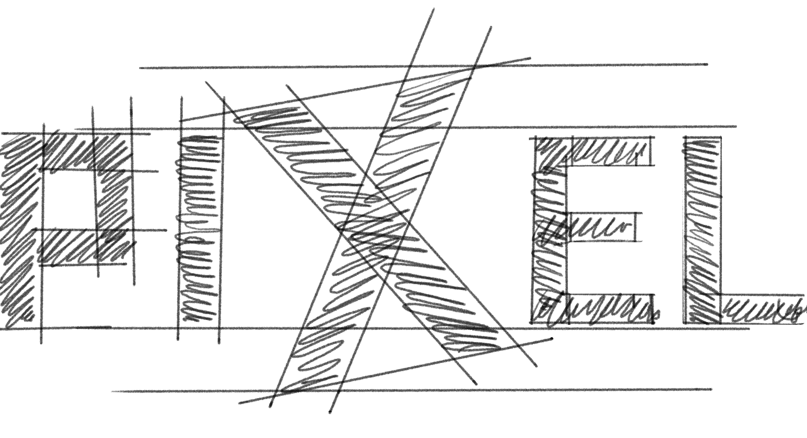

# PIXEL STORE

Pixel Store is a fictional textile company that sells creative and modern fashion products online.


You can check the live application here: [Pixel Store](https://pixel-store-6fb82487a320.herokuapp.com/)
With features such as user authentication, product management, a shopping bag system, and secure checkout integration.

The project focuses on combining aesthetic design with functional usability, aiming to reflect the values of a brand that is both bold and innovative. It supports various screen sizes and provides a seamless experience across desktop, tablet, and mobile devices.

## - User Stories

As a user:

-  **browse products by category** so that I can easily find the items I’m interested in.
-  **view product details** so that I can check price, description.
-  **register an account and log in** so that I can manage my profile and view my orders.
-  **add and remove items from the shopping bag** so that I can control what I purchase.
-  **checkout securely** so that I can pay with confidence and receive confirmation of my order.
-  the website to be **responsive** so that I can shop smoothly on desktop, tablet, or mobile.

## Repository and Live Project  

You can find the source code for **Pixel Store** in the GitHub repository below:  

- **Repository:** [https://github.com/ToniEstarlich/pixel-store](https://github.com/ToniEstarlich/pixel-store)  

The live version of the project is accessible here:  

- **Live Project:** [https://pixel-store-6fb82487a320.herokuapp.com/](https://pixel-store-6fb82487a320.herokuapp.com/)  


## Table of Contents
1. [Tech Stack](#tech-stack)
2. [Wireframes](#wireframes)
3. [The Logo](#the-logo)
4. [Colors](#colors)
5. [UI/UX Screenshots](#uiux-screenshots)
6. [Installation](#installation)
7. [Database](#database)
8. [Backend and Testing](#backend-and-testing)
9. [Problems & Solutions](#problems--solutions)
10. [Code Example](#code-example)
11. [functions and testing](#the-functions-and-their-testing-on-the-pixel-store-app)
12. [Deployment](#deployment)

---

## 🎯 Objective

The goal of Pixel Store is to create an interactive online shop where customers can browse, explore, and purchase textile products in a seamless full-stack web application.

---

##  Tech Stack
# 💻

### 🎨 Style
- **Bootstrap** – Provides responsive and modern design framework.
- **CSS** – Custom styling for layout and visuals.
- **Flexbox** & **Grid** – Layout systems to organize content.

### 🌐 Frontend
- **HTML** – Structure and content.
- **JavaScript** – Interactivity and dynamic actions.
- **Event Listeners** – Capture and handle user input.

### 🚀 Backend
- **Python** – Backend programming logic.
- **Django** – Framework for building web applications.
- **Allauth** – Handles user authentication and accounts.

### 🗄️ Database
- **PostgreSQL** – Relational database for products, users, orders.

### ✏️ Illustration & Design
- **Procreate** – Designed wireframes and UI sketches.
- **Adobe Illustrator** –  creation and branding.

### 🔄 Version Control
- **Git** – Code tracking.
- **GitHub** – Hosting and collaboration.

[Comeback Index](#pixel-store)
---

##  Wireframes
# 🧩

## - Design Iteration

The Pixel Store project went through several design phases:

- Initial **wireframes** outlined the structure of Home, Shop, Bag, and About pages.
- The first version focused on **basic functionality**, ensuring that products could be displayed and added to the bag.
- Based on feedback, the design was refined to improve **navigation, responsiveness, and accessibility**.
- A **vibrant gradient color palette** and a **custom logo** were introduced to reflect the bold and creative identity of the brand.
- Iterations improved the **UI/UX**, including button placement, form validation, and clear error messages during checkout.
- Images and product cards were later optimized for better performance and visual appeal.

---

### Home
| Desktop | Tablet | Mobile |
|--------|--------|--------|
|  |  |  |

### Shop
| Desktop | Tablet | Mobile |
|--------|--------|--------|
|  |  |  |
### Bag
| Desktop | Tablet | Mobile |
|--------|--------|--------|
|  |  |  |

### About
| Desktop | Tablet | Mobile |
|--------|--------|--------|
|  |  |  |

[Comeback Index](#pixel-store)
---

##  The Logo



The Pixel Store logo was designed to represent a young, fresh, and modern textile brand. It combines clean lines with a playful aesthetic to appeal to a fashion-conscious, digital-savvy audience.

The initial concept was hand-sketched using Procreate, capturing the creative spirit of the brand. This sketch was then translated into code using HTML and CSS, ensuring scalability, responsiveness, and seamless integration into the website design.

---

##  Colors
# 🎨
The Pixel Store design uses a vibrant, modern color palette to reflect the brand’s creative and fashion-forward identity. The color choices aim to create contrast, visual interest, and a memorable user experience.


| Purpose                         | Color Code                                          | Description                                                                                                      |
| ------------------------------- | --------------------------------------------------- | ---------------------------------------------------------------------------------------------------------------- |
| **Background Gradient**         | `radial-gradient(circle, #b5179e 0%, #560bad 100%)` | A bold, eye-catching gradient with purple and magenta tones that gives the site a futuristic and trendy vibe.    |
| **Primary Text Highlights**     | `#ff97c9`                                           | A soft neon pink used for accent text elements and headings to enhance readability and style.                    |
| **Icons (default color)**       | `#c0c7cf`                                           | A clean light-gray tone used for neutral icons (like the shopping cart or nav icons).                            |
| **Hover Color (icons & links)** | `#ffc107`                                           | A vibrant yellow/gold tone applied on hover for logo and social media icons, helping to highlight interactivity. |


```css
body {
  background: radial-gradient(circle, rgb(181, 23, 158) 0%, rgb(86, 11, 173) 100%) !important;
  color: #ff97c9 !important;
  font-family: 'Urbanist', sans-serif;
}

.px-navbar {
  backdrop-filter: blur(10px);
  border-bottom: 1px solid #ff97c9;
}
```

Cards, footer, and navbar were designed to be clean and semi-transparent so the focus stays on the products.

[Comeback Index](#pixel-store)
---

##  UI/UX Screenshots

### Home
| Desktop | Tablet | Mobile |
|--------|--------|--------|
|  |  |  |

### Shop
| Desktop | Tablet | Mobile |
|--------|--------|--------|
|  |  |  |

### Bag
| Desktop | Tablet | Mobile |
|--------|--------|--------|
|  |  |  |

### About
| Desktop | Tablet | Mobile |
|--------|--------|--------|
|  |  |  |

[Comeback Index](#pixel-store)
---

## - Git & Version Control  


- Version control was managed using **Git** and hosted on **GitHub**.  
- The project was mainly developed on the **main branch**, with **frequent commits** documenting progress.  
- Clear commit messages (e.g., *added checkout logic*, *fixed product model bug*) were used to track changes.  
- GitHub was also used for deployment to **Heroku**, ensuring smooth version tracking and project backup.  
- The project was initially started using **Django Allauth**, inspired by the e-commerce tutorial video from the course, providing a foundation for user authentication and registration.  
- Custom **context_processors.py** were added to Pixel Store apps to manage shared data across templates, improving code reusability and ensuring dynamic content (e.g., shopping bag contents, product categories) was consistently available.

[Comeback Index](#pixel-store)
---
### What is it and what is it for?
This documentation summarizes the main files in each Pixel Store app:  
- **views.py** → handles the business logic and response to HTTP requests (renders templates, processes forms, manages sessions, etc.)  
- **context_processors.py** → injects common variables into templates (like timestamps, shopping bag contents, categories)  
- **signals.py** → automatically executes functions in response to model events (like creating UserProfiles or loading BagItems on login)  


# The functions and their testing on the Pixel Store app
Use the links below to explore each file’s purpose and its corresponding tests.

## home
- ### [views.py](/docs/apps%20README/home/views_README.md)🟢
  >``home/views.py`` renders the main pages: ``index`` with timestamp, ``faqs``, and ``about``.
- ### [context_processors.py](/docs/apps%20README/home/context_processors_README.md)🟢
  >``home/context_processors.py`` provides a ``timestamp`` context processor, making the current timestamp available in all templates.
  - ### [test](/docs/test%20README/home_README.md)🛑
    >``home/tests/`` verifies views and context processors: pages return 200, correct templates are used, and ``timestamp`` is present and an integer in all templates.

## products
- ### [views.py](/docs/apps%20README/products/views_README.md)🟢
  >``products`` app defines ``Category`` and ``Product`` models, and provides views for listing products (with optional category filter), searching by name, and displaying individual product details, all rendered with Jinja templates.
- ### [context_processors.py](/docs/apps%20README/products/context_processors_README.md)🟢
  >``products/context_processors.py`` provides ``get_categories``, making all product categories available in templates for navigation or filtering.
  - ### [test](/docs/test%20README/products_README.md)🛑
    >``products/tests/`` verifies the ``Category`` model and ``get_categories`` context processor: the model’s ``__str__`` returns the category name, and the context processor provides a list of categories in templates.

## users
- ### [views.py](/docs/apps%20README/users/views_README.md)🟢
  >``users`` app manages user accounts: ``register`` handles signup and creates a ``UserProfile``, ``profile_view`` displays and edits account and profile info, and ``my_orders`` lists the user’s orders.
- ### [signals.py](/docs/apps%20README/users/signals_README.md)🟢
  >``users/signals.py`` listens to ``User`` model changes and automatically creates or updates a ``UserProfile`` whenever a user is created or saved.
  - ### [test](/docs/test%20README/users_README.md)🛑
    >``users/tests/`` verifies user-related functionality: profile page access and template rendering, ``UserProfile`` string representation, and that ``UserProfileForm`` includes all expected fields.

## bag
- ### [views.py](/docs/apps%20README/bag/views_README.md)🟢
  >``bag`` app manages the shopping bag: ``view_bag`` displays items with totals, ``add_to_bag`` adds or updates items via POST/AJAX, ``remove_from_bag`` deletes items, and ``clear_bag`` empties the bag for the user.
- ### [context_processors.py](/docs/apps%20README/bag/context_processors_README.md)🟢
  >``bag/context_processors.py`` provides ``bag_contents`` and ``calculate_bag_total``, making the current shopping bag items, counts, and totals available in all templates.
- ### [signals.py](/docs/apps%20README/bag/signals_README.md)🟢
  >``bag/apps.py`` activates signals on app ready, and ``bag/signals.py`` automatically loads a logged-in user’s ``BagItems`` into the session, reconstructing the shopping bag.
  - ### [test](/docs/test%20README/bag_README.md)🛑
    >``bag/tests/`` verifies shopping bag functionality: pages return 200 and use correct templates, add/remove/clear actions update session and redirect properly, URLs resolve correctly, and context processors calculate totals, counts, and bag items accurately.

## checkout
- ### [views.py](/docs/apps%20README/checkout/views_README.md)🟢
  >``checkout/`` handles order processing: displays checkout form if the bag isn’t empty, validates and saves orders and line items, creates a Stripe checkout session, empties the bag, and shows a success page with order details.
  - ### [test](/docs/test%20README/checkout_README.md)🛑
    >checkout/tests/ verifies the checkout flow: redirects when the bag is empty, ensures checkout success page loads correctly, confirms order numbers are auto-generated, and validates the OrderForm with correct data.

# 📱 User Experience (UX) — Pixel Store
After creating an account, the user can:

- Browse products and filter by category
- Search products by name
- View product details
- Add, update, or remove items in the shopping bag
- Proceed to checkout and complete orders
- View order history in their profile
- Edit account and shipping information
---
##  Problems & Solutions
# ❗

## HTML Validation
The HTML code was validated using the W3C Markup Validation Service.  
[https://validator.w3.org/](https://validator.w3.org/)

### Problem:
- The validator showed some warnings and minor errors.
- Most issues come from external libraries (e.g. Font Awesome, Bootstrap).
- Use of `<i>` tags for icons and dynamic attributes like `aria-*`.

### Solutions:
- No changes were made because:
  - These issues are not critical.
  - They do not affect accessibility or functionality.
  - They originate from trusted third-party libraries.

---

## CSS Validation
The CSS was validated using the W3C CSS Validator.  
[https://jigsaw.w3.org/css-validator/](https://jigsaw.w3.org/css-validator/)

### Problem:
- One error from Font Awesome CDN:
  - `rotate(var(--fa-rotate-angle, none))` is not a valid transform value.
- 1400+ warnings due to:
  - Vendor extensions like `-webkit-` and `-moz-`.
  - Use of CSS variables in the external stylesheet.

### Solutions:
- No changes were made because:
  - All issues come from an external CDN (Font Awesome).
  - Modifying CDN files is not recommended.
  - The website displays correctly with the current styles.

### Problem:
- Database `makemigrations` failed due to wrong plural naming.

### Solution:
- Added `verbose_name_plural = "Categories"` inside Meta class.

[Comeback Index](#pixel-store)
---
## Deployment

Pixel Store was deployed to **Heroku** using a **Heroku PostgreSQL** database.  
Below is the exact process I followed to deploy the project:

1. I created a new Heroku app from the Heroku dashboard.
2. In the **Resources** tab, I added the **Heroku PostgreSQL** add-on so the project could use Postgres in production.
3. In the **Settings → Config Vars**, I added all required environment variables:
   - `DATABASE_URL` (created automatically by Heroku Postgres)
   - `SECRET_KEY`
   ...
4. I connected my GitHub repository to Heroku in the **Deploy** tab and selected the main branch.
5. I clicked **Deploy Branch**, and Heroku built the Django project.
6. After the build completed, I ran the database migrations directly on Heroku:
   ```bash
   heroku run python manage.py migrate
   ```

## 📫 Contact
## Installation
# 🛠️ 

Clone the repository and install dependencies:

```bash
git clone https://github.com/ToniEstarlich/pixel-store.git
cd pixel-store
pip install -r requirements.txt
python manage.py migrate
python manage.py runserver
```